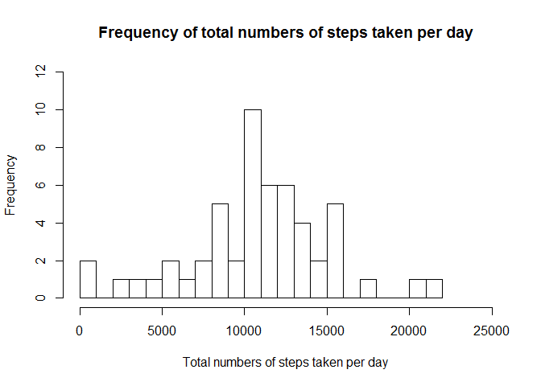
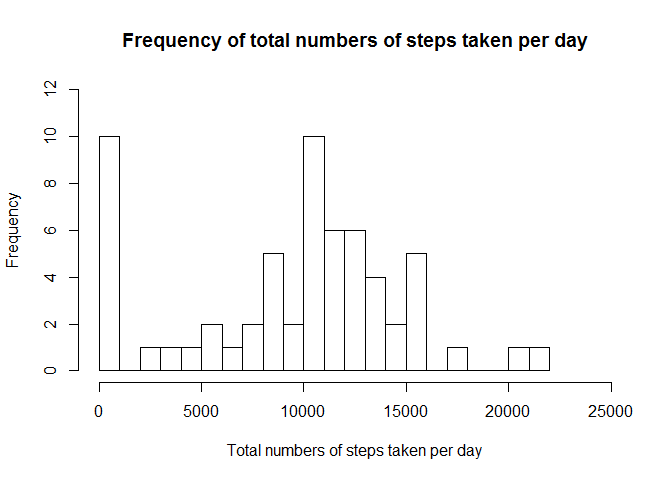
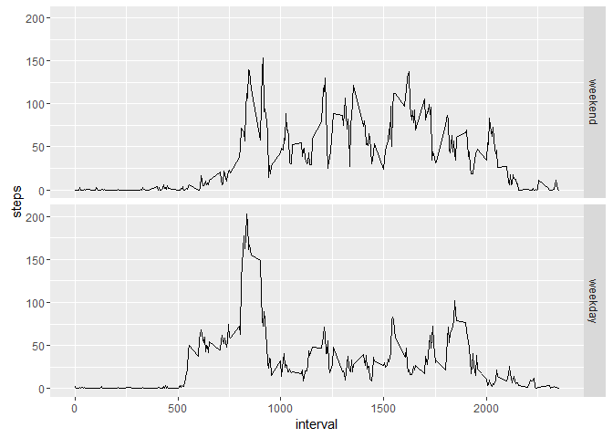

# Peer Assessment 1 - Reproducible Research


This Assignment consists of five parts.

### 1) Loading & preprocessing the data

Set the working directory, then read in the data and look at the first few observations in order to get an overview of the dataset.


```r
setwd("~/Coursera/Data_Science/5_Reproducible_Research/Assignment_1/repdata_data_activity")
data <- read.csv("activity.csv",header = TRUE, sep = ",",stringsAsFactors = FALSE)
head(data)
```

```
##   steps       date interval
## 1    NA 2012-10-01        0
## 2    NA 2012-10-01        5
## 3    NA 2012-10-01       10
## 4    NA 2012-10-01       15
## 5    NA 2012-10-01       20
## 6    NA 2012-10-01       25
```

### 2) Mean total number of steps taken per day

Histogram of the total number of steps taken per day:


```r
library(dplyr)
data_sum_days <- data %>% group_by(date) %>% summarise(steps = sum(steps))
hist(data_sum_days$steps, breaks = 25, main = "Frequency of total numbers of steps taken per day" , xlab = "Total numbers of steps taken per day",xlim=c(0,25000), ylim=c(0,12))
```



Mean & median of the total number of steps taken per day:

(Note that you need to use na.rm = TRUE, otherwise you will yield NA as a result.)


```r
mean(data_sum_days$steps, na.rm = TRUE)
```

```
## [1] 10766.19
```

```r
median(data_sum_days$steps, na.rm = TRUE)
```

```
## [1] 10765
```

### 3) Average daily activity pattern:

(I removed the missing values here because R Studio would otherwise throw an error.)


```r
data_daily_average <- data %>% group_by(interval) %>% summarise(steps = mean(steps , na.rm = TRUE))
plot(data_daily_average, type = "l")
```


```r
data_daily_average <- as.data.frame(data_daily_average)
data_daily_average[which.max(data_daily_average$steps),]
```

```
##     interval    steps
## 104      835 206.1698
```

The time interval 835 contains the maximum number of steps on average across all
the days in the dataset.

### 4) Imputing missing values

Total number of missing values in the dataset:


```r
library(muStat)
length(which.na(data$steps))
```

```
## [1] 2304
```

Imputing missing values with 0:
(I was unable to write the code to impute the average of the 5-minute interval due 
to the limited time in this first week. I spent a few hours trying. I would really appreciate any hint on how to do that.)


```r
data_imputed_NA <- data
data_imputed_NA[is.na(data_imputed_NA)] <- 0

library(dplyr)
data_sum_days_imputed <- data_imputed_NA %>% group_by(date) %>% summarise(steps = sum(steps))
hist(data_sum_days_imputed$steps, breaks = 25, main = "Frequency of total numbers of steps taken per day" , xlab = "Total numbers of steps taken per day",xlim=c(0,25000), ylim=c(0,12))
```



Mean & median of the total number of steps taken per day:


```r
mean(data_sum_days_imputed$steps)
```

```
## [1] 9354.23
```

```r
median(data_sum_days_imputed$steps)
```

```
## [1] 10395
```

In the histogram you can see that there is no change besides the bar indicating the days with 0 steps has drastically increased. The mean and median decreased due to the imputation of 0s. You can see in this example that it is not really helpful to impute 0s because thereby, most likely, you underestimate the number of steps.

### 5) Differences in activity patterns between weekdays & weekends


```r
Sys.setlocale("LC_TIME", "English")
```

```
## [1] "English_United States.1252"
```

```r
data_imputed_NA$date <- as.Date(data_imputed_NA$date)
weekDAY <- c("Monday", "Tuesday", "Wednesday", "Thursday", "Friday")
data_imputed_NA$day <- factor((weekdays(data_imputed_NA$date) %in% weekDAY), levels=c(FALSE, TRUE), labels=c('weekend', 'weekday')) 
Sys.setlocale("LC_TIME", "German")
```

```
## [1] "German_Germany.1252"
```

```r
library(ggplot2)
data_mean_intervals_imputed <- data_imputed_NA %>% group_by(interval,day) %>% summarise(steps = mean(steps))
ggplot(data_mean_intervals_imputed,aes(interval,steps)) + geom_line() + facet_grid(day ~ .)
```




